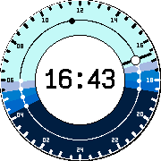

# SunDial for Pebble

An astronomical Watchface for Pebble Time and Pebble Round, inspired by [Apple Watch Solar Dial](https://www.hodinkee.com/articles/the-eerie-beauty-of-the-apple-watch-solar-face-and-the-anatomy-of-nightfall).

+ Sunset, Sunrise, Noon, Civil, Nautical and Astronomical Dawn and Dusk at a glance;
+ Adaptive configuration via location data;
+ Automatically switching Day and Night themes.

## Planned Features

+ 12h format support
+ Analog clock support
+ Demo mode
+ Weather forecast, Calendar, Battery widgets
+ GFX improvements